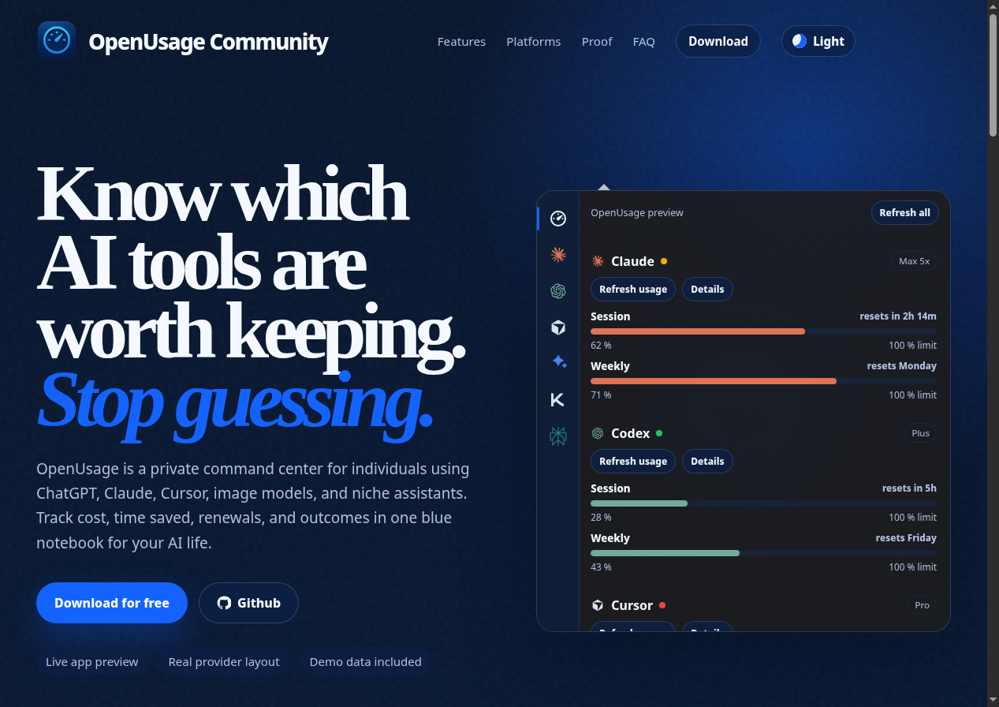

<div align="center">
  

  <h1>OpenUsage Community Landing</h1>

  <p>
    Marketing landing page for OpenUsage Community, with a live-feeling product preview,
    provider-focused download flow, and clear project attribution.
  </p>

  <p>
    <a href="https://openusage-community.github.io/openusage-landing/">Live site</a>
    ·
    <a href="https://github.com/openusage-community/openusage">OpenUsage app</a>
    ·
    <a href="https://github.com/robinebers/openusage">Original project</a>
    ·
    <a href="https://github.com/robinebers">Original author</a>
  </p>
</div>



## What This Is

This repository contains the public landing page for OpenUsage Community.

The site is intentionally simple: a static Vite app using React, TypeScript, and plain CSS. It presents the product, shows an interactive preview of the OpenUsage provider layout, and guides users to Linux or macOS release downloads.

## Highlights

- Dark-first marketing page for OpenUsage Community.
- Interactive app preview with real provider-style navigation.
- Download flow for Linux and macOS release assets.
- Project origin section crediting the original OpenUsage by Robin Ebers.
- No backend, no CMS, no heavy framework.

## Tech Stack

- React
- TypeScript
- Vite
- CSS

## Run Locally

```bash
npm install
npm run dev
```

Open the URL printed by Vite.

## Build

```bash
npm run build
```

## Repository Links

- Landing page repo: https://github.com/openusage-community/openusage-landing
- Live site: https://openusage-community.github.io/openusage-landing/
- OpenUsage Community app: https://github.com/openusage-community/openusage
- Original OpenUsage project: https://github.com/robinebers/openusage
- Original author: https://github.com/robinebers
